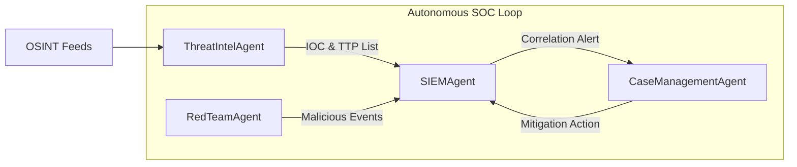
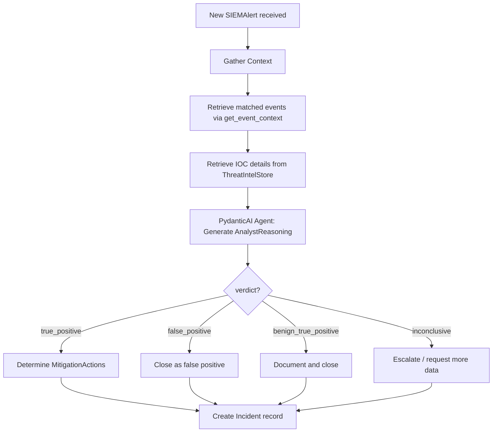
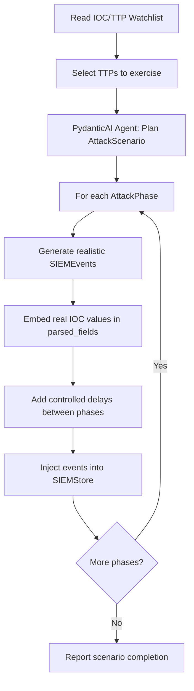
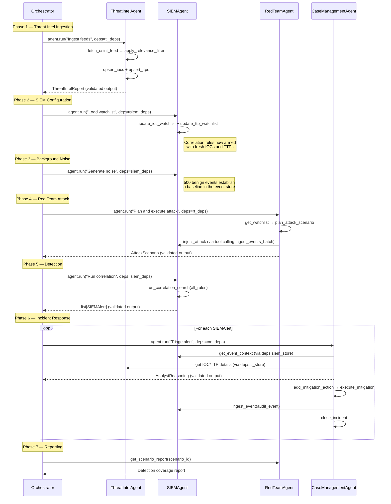

# Autonomous SOC Simulation — Technical Specification

> **Status:** Draft v3 — PydanticAI + Gemini 3.1 Pro
> **Date:** 2026-02-22
> **Author:** SOC Architect Agent

---

## 1. Overview

This document specifies the design of a fully autonomous Security Operations Center (SOC) simulation. The system emulates four interconnected subsystems as **PydanticAI-powered agents** with tool-backed state stores:

| Subsystem | Real-World Analog | Role |
|---|---|---|
| **ThreatIntelAgent** | Recorded Future | Ingest OSINT → produce structured IOCs & TTPs |
| **SIEMAgent** | Splunk | Store events, run correlation searches, fire alerts |
| **CaseManagementAgent** | TheHive / ServiceNow | Track incidents end-to-end with analyst reasoning |
| **RedTeamAgent** | Adversary Simulation | Generate attack traffic that exercises the whole pipeline |



The **end-to-end loop** is:

1. **ThreatIntelAgent** ingests OSINT and produces an IOC/TTP watchlist.
2. **RedTeamAgent** reads the watchlist and generates realistic attack events using those exact IOCs/TTPs.
3. Attack events land in the **SIEMAgent**'s event store alongside benign background noise.
4. The SIEM's **Correlation Search** matches events against the watchlist and fires an **Alert**.
5. The **CaseManagementAgent** receives the alert, performs analyst reasoning, and records a **Mitigation Action**.
6. The mitigation action is fed back into the SIEM as an audit event, closing the loop.

---

## 2. Shared Data Models (Pydantic)

All models live in `auto_soc/models/`.

### 2.1 Threat Intel Models — `models/threat_intel.py`

```python
class IOC(BaseModel):
    """A single Indicator of Compromise."""
    id: str                          # UUID4, auto-generated
    type: Literal[
        "ipv4", "ipv6", "domain",
        "url", "sha256", "md5",
        "email", "cve"
    ]
    value: str                       # e.g. "203.0.113.42"
    source: str                      # e.g. "abuse.ch", "OTX"
    severity: Literal[
        "critical", "high",
        "medium", "low", "info"
    ]
    tags: list[str]                  # e.g. ["cobalt-strike", "c2"]
    first_seen: datetime
    last_seen: datetime
    confidence: float                # 0.0 – 1.0
    context: str                     # LLM-generated summary of why this IOC matters

class TTP(BaseModel):
    """A MITRE ATT&CK Technique / Sub-technique."""
    id: str                          # UUID4
    mitre_id: str                    # e.g. "T1059.001"
    name: str                        # e.g. "PowerShell"
    tactic: str                      # e.g. "Execution"
    description: str                 # Human-readable description
    associated_iocs: list[str]       # List of IOC.id references
    severity: Literal[
        "critical", "high",
        "medium", "low"
    ]
    confidence: float                # 0.0 – 1.0

class ThreatIntelReport(BaseModel):
    """The structured output of one Threat Intel ingestion cycle."""
    report_id: str                   # UUID4
    generated_at: datetime
    source_feed: str                 # Feed name / URL
    raw_item_count: int              # Total items fetched
    relevant_item_count: int         # Items that passed the relevance filter
    iocs: list[IOC]
    ttps: list[TTP]
    summary: str                     # LLM-generated executive summary
```

### 2.2 SIEM Models — `models/siem.py`

```python
class SIEMEvent(BaseModel):
    """A single log event ingested by the SIEM."""
    event_id: str                    # UUID4
    timestamp: datetime
    source_system: Literal[
        "firewall", "edr", "proxy",
        "dns", "auth", "email_gateway",
        "red_team"                   # Explicit tag for simulated attacks
    ]
    severity: Literal[
        "critical", "high",
        "medium", "low", "info"
    ]
    raw_log: str                     # The original log line / JSON blob
    parsed_fields: dict[str, Any]    # Normalized key-value pairs
    #  ↳ Expected keys vary by source_system but MUST include:
    #    src_ip, dst_ip, action, user, hostname, process_name,
    #    file_hash, domain, url   (Any absent key → None)
    matched_ioc_ids: list[str]       # IOC IDs matched post-ingestion (populated by correlation)
    matched_ttp_ids: list[str]       # TTP IDs matched post-ingestion

class CorrelationRule(BaseModel):
    """Defines a single correlation / detection rule."""
    rule_id: str                     # UUID4
    name: str                        # Human-friendly name
    description: str
    mitre_ids: list[str]             # MITRE ATT&CK IDs this rule covers
    match_logic: Literal[
        "ioc_match",                 # Any field value matches a known IOC
        "ttp_pattern",              # Sequence of events matches a TTP pattern
        "threshold",                # N events of type X within Y seconds
        "compound"                  # Combination of the above
    ]
    match_config: dict[str, Any]    # Rule-specific parameters (see §3.2)
    severity: Literal[
        "critical", "high",
        "medium", "low"
    ]
    enabled: bool

class SIEMAlert(BaseModel):
    """An alert fired by a correlation rule."""
    alert_id: str                    # UUID4
    triggered_at: datetime
    rule: CorrelationRule            # The rule that fired
    matched_events: list[str]        # List of SIEMEvent.event_id
    matched_iocs: list[str]         # IOC IDs involved
    matched_ttps: list[str]         # TTP IDs involved
    severity: Literal[
        "critical", "high",
        "medium", "low"
    ]
    status: Literal[
        "new", "acknowledged",
        "investigating", "closed"
    ]
    summary: str                     # LLM-generated alert narrative
```

### 2.3 Case Management Models — `models/case_management.py`

```python
class MitigationAction(BaseModel):
    """A concrete action taken (or recommended) to contain/remediate."""
    action_id: str                   # UUID4
    action_type: Literal[
        "block_ip", "block_domain",
        "isolate_host", "disable_account",
        "revoke_token", "quarantine_file",
        "patch_vulnerability", "no_action"
    ]
    target: str                      # e.g. "203.0.113.42" or "WKSTN-042"
    executed: bool                   # Whether the action was actually performed
    executed_at: datetime | None
    notes: str                       # Analyst reasoning for this specific action

class AnalystReasoning(BaseModel):
    """Structured chain-of-thought from the analyst agent."""
    hypothesis: str                  # Initial theory, e.g. "Likely C2 beaconing"
    evidence_for: list[str]          # Bullet points supporting the hypothesis
    evidence_against: list[str]      # Bullet points contradicting it
    confidence: float                # 0.0 – 1.0
    verdict: Literal[
        "true_positive",
        "false_positive",
        "benign_true_positive",      # Real activity, but authorized (e.g. pen test)
        "inconclusive"
    ]

class Incident(BaseModel):
    """A full incident record in the case management system."""
    incident_id: str                 # UUID4
    created_at: datetime
    updated_at: datetime
    status: Literal[
        "open", "investigating",
        "contained", "remediated",
        "closed"
    ]
    priority: Literal[
        "P1", "P2", "P3", "P4"
    ]
    title: str                       # e.g. "C2 Beaconing to 203.0.113.42"
    source_alert: SIEMAlert          # The alert that spawned this incident
    affected_assets: list[str]       # Hostnames / IPs / user accounts
    analyst_reasoning: AnalystReasoning
    mitigation_actions: list[MitigationAction]
    timeline: list[str]              # Chronological narrative entries
    summary: str                     # LLM-generated final summary
    closed_at: datetime | None
```

### 2.4 Red Team Models — `models/red_team.py`

```python
class AttackScenario(BaseModel):
    """A planned Red Team attack campaign."""
    scenario_id: str                 # UUID4
    name: str                        # e.g. "Cobalt Strike Beacon via Phishing"
    target_ttps: list[str]          # TTP.mitre_id values to exercise
    target_iocs: list[str]          # IOC.id values to embed in the attack
    phases: list[AttackPhase]
    created_at: datetime

class AttackPhase(BaseModel):
    """A single phase/step of an attack scenario."""
    phase_id: str                    # UUID4
    order: int                       # 1, 2, 3 …
    mitre_id: str                    # e.g. "T1566.001"
    description: str                 # What the attacker does
    generated_events: list[SIEMEvent]  # Events this phase would produce
    delay_seconds: int               # Simulated delay before next phase
```

---

## 3. Subsystem Designs

### 3.1 Threat Intel Agent (`agents/threat_intel_agent.py`)

#### Purpose
Emulate Recorded Future by ingesting OSINT feeds, filtering for relevance, and producing a structured IOC/TTP watchlist that the SIEM and Red Team consume.

#### PydanticAI Agent Definition

```python
from pydantic_ai import Agent, RunContext
from dataclasses import dataclass

@dataclass
class ThreatIntelDeps:
    """Dependencies injected into every tool call via RunContext."""
    store: ThreatIntelStore
    relevance_config: RelevanceConfig
    org_profile: dict

threat_intel_agent = Agent(
    "google-gla:gemini-3.1-pro",
    deps_type=ThreatIntelDeps,
    output_type=ThreatIntelReport,
    system_prompt=(
        "You are a Threat Intelligence Analyst at a financial institution. "
        "Your job is to ingest raw OSINT feeds, filter for relevance, "
        "and produce a structured IOC/TTP watchlist with executive summaries."
    ),
)
```

#### Data Store — `ThreatIntelStore`

```python
class ThreatIntelStore:
    iocs: dict[str, IOC]             # keyed by IOC.id
    ttps: dict[str, TTP]             # keyed by TTP.id
    reports: list[ThreatIntelReport]
    relevance_config: RelevanceConfig
```

#### Relevance Engine — How the Agent Decides What Is "Relevant"

The agent uses a **two-stage filter**:

**Stage 1 — Rule-Based Pre-Filter** (fast, deterministic):

| Criterion | Logic | Rationale |
|---|---|---|
| Recency | `last_seen` within the past 30 days | Stale IOCs generate noise |
| Confidence Floor | `confidence >= 0.4` | Below this = unverified speculation |
| Severity Floor | `severity` ∈ `{critical, high, medium}` | `low`/`info` are informational only |
| Sector Relevance | `tags` ∩ `config.sector_tags ≠ ∅` | Only IOCs tagged to our industry |
| Dedup | IOC `value` not already in `ThreatIntelStore.iocs` | Avoid redundant entries |

```python
class RelevanceConfig(BaseModel):
    max_age_days: int = 30
    min_confidence: float = 0.4
    min_severity: Literal["critical","high","medium","low"] = "medium"
    sector_tags: list[str]           # e.g. ["financial", "banking", "fintech"]
    excluded_sources: list[str]      # Known low-quality feeds to skip
```

**Stage 2 — LLM Relevance Assessment** (via PydanticAI structured output):

Items surviving Stage 1 are batched (≤ 20 per call) and the agent outputs a structured assessment. PydanticAI enforces the response schema automatically via `output_type`:

```python
class RelevanceAssessment(BaseModel):
    """LLM output for a single indicator's relevance."""
    indicator_id: str
    relevant: bool
    confidence: float                # 0.0–1.0
    context: str                     # 1-sentence explanation
    associated_mitre_ids: list[str]

class BatchRelevanceResult(BaseModel):
    assessments: list[RelevanceAssessment]
```

> [!NOTE]
> With PydanticAI, the LLM is **forced** to return a valid `BatchRelevanceResult`. No JSON parsing or error handling needed — validation is automatic.

#### Tool Functions (registered via `@agent.tool`)

```python
@threat_intel_agent.tool
async def fetch_osint_feed(ctx: RunContext[ThreatIntelDeps], feed_url: str) -> list[dict]:
    """Pull raw items from an OSINT feed (simulated). Returns raw JSON dicts."""
    ...

@threat_intel_agent.tool
async def apply_relevance_filter(
    ctx: RunContext[ThreatIntelDeps], raw_items: list[dict]
) -> list[dict]:
    """Stage 1 rule-based filter. Uses ctx.deps.relevance_config."""
    ...

@threat_intel_agent.tool
async def upsert_iocs(ctx: RunContext[ThreatIntelDeps], iocs: list[IOC]) -> int:
    """Add/update IOCs in ctx.deps.store. Returns count of new entries."""
    ...

@threat_intel_agent.tool
async def upsert_ttps(ctx: RunContext[ThreatIntelDeps], ttps: list[TTP]) -> int:
    """Add/update TTPs in ctx.deps.store. Returns count of new entries."""
    ...

@threat_intel_agent.tool
async def get_active_watchlist(ctx: RunContext[ThreatIntelDeps]) -> dict[str, list]:
    """Returns {"iocs": [...], "ttps": [...]} of all current active items."""
    ...
```

> [!TIP]
> PydanticAI uses the tool function's **docstring** as the tool description sent to the LLM, and uses the **type hints** to build the tool's input schema automatically. No separate schema definition needed.

---

### 3.2 SIEM Agent (`agents/siem_agent.py`)

#### Purpose
Emulate Splunk by storing security events, running correlation searches against the IOC/TTP watchlist, and firing alerts.

#### PydanticAI Agent Definition

```python
@dataclass
class SIEMDeps:
    store: SIEMStore
    ioc_watchlist: dict[str, IOC]    # value → IOC for fast lookup
    ttp_watchlist: dict[str, TTP]    # mitre_id → TTP

siem_agent = Agent(
    "google-gla:gemini-3.1-pro",
    deps_type=SIEMDeps,
    output_type=list[SIEMAlert],
    system_prompt=(
        "You are a SIEM correlation engine. You ingest security events, "
        "match them against IOC/TTP watchlists, and fire alerts when "
        "detection rules trigger."
    ),
)
```

#### Data Store — `SIEMStore`

```python
class SIEMStore:
    events: list[SIEMEvent]                     # Append-only event log
    events_by_id: dict[str, SIEMEvent]          # Index for fast lookup
    alerts: list[SIEMAlert]                     # All generated alerts
    rules: list[CorrelationRule]                # Active detection rules
    ioc_index: dict[str, list[str]]             # IOC.value → list[event_id]
    field_index: dict[str, dict[str, list[str]]]
    #  ↳ field_name → { field_value → [event_id] }
    #  ↳ indexes: src_ip, dst_ip, domain, file_hash, user, hostname
```

**Storage Logic:**

1. **Ingest** — Each `SIEMEvent` is appended to `events` and registered in `events_by_id`.
2. **Index** — On ingest, every non-`None` value in `parsed_fields` is added to `field_index`. This gives O(1) lookup by any field value.
3. **IOC Enrichment** — On ingest, every field value is checked against the current IOC watchlist. Matches populate `SIEMEvent.matched_ioc_ids`.

#### Correlation Search — How Detection Works

Correlation runs in two modes: **on-ingest** (real-time) and **scheduled** (batch).

**On-Ingest (Real-Time):**
For every new event, the SIEM iterates over `rules` where `match_logic == "ioc_match"`:

```
for rule in active_rules:
    if rule.match_logic == "ioc_match":
        for field_key, field_val in event.parsed_fields.items():
            if field_val in ioc_watchlist_values:
                → fire_alert(rule, [event], matched_iocs, matched_ttps)
```

**Scheduled (Batch) — runs every N events or on-demand:**

| `match_logic` | Algorithm | `match_config` Keys |
|---|---|---|
| `ioc_match` | Scan `field_index` for any value present in the IOC watchlist. | `ioc_types: list[str]` — which IOC types to match against |
| `ttp_pattern` | Sequence detection: look for ordered events matching a TTP kill chain within a time window on the same host/user. | `sequence: list[dict]` — ordered event field matchers, `window_seconds: int` |
| `threshold` | Count events matching a filter; fire if count ≥ N within window. | `filter: dict`, `threshold: int`, `window_seconds: int` |
| `compound` | Boolean combination of the above sub-rules using AND/OR logic. | `sub_rules: list[str]` (rule_ids), `operator: "AND" \| "OR"` |

**Example `ttp_pattern` match_config:**

```json
{
    "sequence": [
        {"source_system": "email_gateway", "action": "delivered"},
        {"source_system": "edr", "process_name": "powershell.exe"},
        {"source_system": "proxy", "action": "connect", "dst_ip": "$MATCHED_IOC"}
    ],
    "window_seconds": 3600,
    "group_by": "hostname"
}
```

This detects: *phishing email → PowerShell execution → C2 callback* on the same host within 1 hour.

#### Tool Functions

```python
@siem_agent.tool
async def ingest_event(ctx: RunContext[SIEMDeps], event: SIEMEvent) -> str:
    """Ingest a single event: index, enrich, run real-time correlation. Returns event_id."""
    ...

@siem_agent.tool
async def ingest_events_batch(ctx: RunContext[SIEMDeps], events: list[SIEMEvent]) -> list[str]:
    """Batch ingest. Returns list of event_ids."""
    ...

@siem_agent.tool
async def run_correlation_search(
    ctx: RunContext[SIEMDeps], rule_id: str | None = None
) -> list[SIEMAlert]:
    """Run one or all correlation rules against the event store. Returns new alerts."""
    ...

@siem_agent.tool
async def update_ioc_watchlist(ctx: RunContext[SIEMDeps], iocs: list[IOC]) -> int:
    """Refresh the internal IOC lookup table. Returns watchlist size."""
    ...

@siem_agent.tool
async def update_ttp_watchlist(ctx: RunContext[SIEMDeps], ttps: list[TTP]) -> int:
    """Refresh the internal TTP lookup table. Returns watchlist size."""
    ...

@siem_agent.tool
async def search_events(ctx: RunContext[SIEMDeps], query: dict) -> list[SIEMEvent]:
    """Field-based search against the event store. query is {field: value}."""
    ...

@siem_agent.tool
async def get_alert(ctx: RunContext[SIEMDeps], alert_id: str) -> SIEMAlert:
    """Retrieve a specific alert with full context."""
    ...

@siem_agent.tool
async def update_alert_status(ctx: RunContext[SIEMDeps], alert_id: str, status: str) -> SIEMAlert:
    """Transition alert status."""
    ...

@siem_agent.tool
async def get_event_context(
    ctx: RunContext[SIEMDeps], event_id: str, window_seconds: int = 300
) -> list[SIEMEvent]:
    """Get surrounding events within a time window for the same src_ip/hostname."""
    ...

@siem_agent.tool
async def generate_background_noise(ctx: RunContext[SIEMDeps], count: int) -> list[SIEMEvent]:
    """Create realistic benign events to add noise to the event store."""
    ...
```

---

### 3.3 Case Management Agent (`agents/case_management_agent.py`)

#### Purpose
Emulate TheHive / ServiceNow by receiving SIEM alerts, triaging them with LLM-powered analyst reasoning, and tracking incidents through resolution.

#### PydanticAI Agent Definition

```python
@dataclass
class CaseManagementDeps:
    case_store: CaseStore
    siem_store: SIEMStore            # For fetching event context
    ti_store: ThreatIntelStore       # For fetching IOC/TTP details
    org_profile: dict

case_management_agent = Agent(
    "google-gla:gemini-3.1-pro",
    deps_type=CaseManagementDeps,
    output_type=AnalystReasoning,    # LLM returns structured triage reasoning
    system_prompt=(
        "You are a Tier 2 SOC Analyst. You receive SIEM alerts, investigate "
        "the surrounding context, and produce structured analyst reasoning "
        "including hypothesis, evidence, confidence, and verdict."
    ),
)
```

> [!IMPORTANT]
> The `output_type=AnalystReasoning` means PydanticAI **forces** the LLM to return a valid `AnalystReasoning` object. No need for the manual JSON schema in the prompt — PydanticAI injects it automatically and validates the response.

#### Data Store — `CaseStore`

```python
class CaseStore:
    incidents: dict[str, Incident]        # keyed by incident_id
    incidents_by_alert: dict[str, str]    # alert_id → incident_id (dedup)
    open_incidents: list[str]             # incident_ids with status != "closed"
```

#### Analyst Reasoning — How the Agent Triages



#### Mitigation Action Selection Logic

| IOC Type | Severity ≥ High | Severity = Medium | Severity = Low |
|---|---|---|---|
| `ipv4` / `ipv6` | `block_ip` | `block_ip` | `no_action` (monitor) |
| `domain` / `url` | `block_domain` | `block_domain` | `no_action` |
| `sha256` / `md5` | `quarantine_file` | `quarantine_file` | `no_action` |
| `email` | `disable_account` | `disable_account` | `no_action` |
| `cve` | `patch_vulnerability` + `isolate_host` | `patch_vulnerability` | `no_action` |

If the matched TTP indicates **lateral movement** (`T1021.*`), an additional `isolate_host` action is appended regardless of severity.

#### Tool Functions

```python
@case_management_agent.tool
async def create_incident(ctx: RunContext[CaseManagementDeps], alert: SIEMAlert) -> Incident:
    """Initialize an incident from an alert. Auto-deduplicates by alert_id."""
    ...

@case_management_agent.tool
async def triage_incident(ctx: RunContext[CaseManagementDeps], incident_id: str) -> AnalystReasoning:
    """Gather context from SIEM + TI stores, then invoke the LLM for analyst reasoning."""
    ...

@case_management_agent.tool
async def add_mitigation_action(
    ctx: RunContext[CaseManagementDeps], incident_id: str, action: MitigationAction
) -> Incident:
    """Append a mitigation action and log to timeline."""
    ...

@case_management_agent.tool
async def execute_mitigation(
    ctx: RunContext[CaseManagementDeps], incident_id: str, action_id: str
) -> MitigationAction:
    """Mark an action as executed and produce a SIEM audit event."""
    ...

@case_management_agent.tool
async def update_incident_status(
    ctx: RunContext[CaseManagementDeps], incident_id: str, status: str
) -> Incident:
    """Transition incident lifecycle status."""
    ...

@case_management_agent.tool
async def get_incident(ctx: RunContext[CaseManagementDeps], incident_id: str) -> Incident:
    """Retrieve full incident details."""
    ...

@case_management_agent.tool
async def list_open_incidents(ctx: RunContext[CaseManagementDeps]) -> list[Incident]:
    """Get all open/investigating incidents."""
    ...

@case_management_agent.tool
async def close_incident(
    ctx: RunContext[CaseManagementDeps], incident_id: str, summary: str
) -> Incident:
    """Close with final summary. Sets closed_at."""
    ...
```

---

### 3.4 Red Team Agent (`agents/red_team_agent.py`)

#### Purpose
Simulate adversary behavior by consuming the IOC/TTP watchlist and generating realistic attack traffic that should trigger the SIEM's detection rules, validating the full pipeline end-to-end.

#### PydanticAI Agent Definition

```python
@dataclass
class RedTeamDeps:
    ti_store: ThreatIntelStore       # Read the watchlist
    siem_store: SIEMStore            # Inject attack events
    config: RedTeamConfig

red_team_agent = Agent(
    "google-gla:gemini-3.1-pro",
    deps_type=RedTeamDeps,
    output_type=AttackScenario,      # LLM returns a structured attack plan
    system_prompt=(
        "You are a Red Team Operator. You design multi-phase attack scenarios "
        "that use IOCs and TTPs from the current threat intel watchlist. "
        "Your attacks must follow realistic ATT&CK kill chain ordering."
    ),
)
```

#### Attack Generation Logic



**Key Design Decisions:**

1. **IOC Embedding**: The Red Team deliberately uses IOC values from the watchlist (IPs, domains, hashes) so the SIEM's `ioc_match` correlation will detect them.

2. **TTP Sequencing**: The agent plans multi-phase attacks that follow real ATT&CK kill chains (e.g. "Spearphishing → Execution → C2").

3. **Noise Interspersion**: Attack events are mixed with benign noise so the SIEM must distinguish signals from noise.

4. **Controlled Difficulty**:

| Difficulty | Behavior |
|---|---|
| `easy` | Direct IOC matches, single-host, short time window |
| `medium` | IOC matches + some obfuscation, multi-host |
| `hard` | Partial IOC matches, long time windows, living-off-the-land techniques |

```python
class RedTeamConfig(BaseModel):
    difficulty: Literal["easy", "medium", "hard"] = "medium"
    max_scenarios: int = 3
    max_phases_per_scenario: int = 5
    noise_ratio: float = 5.0        # benign events per attack event
    delay_between_phases: int = 60   # seconds (simulated)
```

#### Tool Functions

```python
@red_team_agent.tool
async def get_watchlist(ctx: RunContext[RedTeamDeps]) -> dict:
    """Fetch current IOC/TTP watchlist from ThreatIntelStore."""
    ...

@red_team_agent.tool
async def plan_attack_scenario(ctx: RunContext[RedTeamDeps]) -> AttackScenario:
    """Use the LLM to plan a multi-phase attack scenario."""
    ...

@red_team_agent.tool
async def generate_attack_events(
    ctx: RunContext[RedTeamDeps], phase: AttackPhase
) -> list[SIEMEvent]:
    """Generate realistic SIEM events for one attack phase."""
    ...

@red_team_agent.tool
async def inject_attack(ctx: RunContext[RedTeamDeps], scenario: AttackScenario) -> dict:
    """Execute a full scenario: inject all phase events into the SIEM.
    Returns {"events_injected": int, "scenario_id": str}."""
    ...

@red_team_agent.tool
async def generate_noise(ctx: RunContext[RedTeamDeps], count: int) -> list[SIEMEvent]:
    """Generate benign noise events and inject into SIEM."""
    ...

@red_team_agent.tool
async def get_scenario_report(ctx: RunContext[RedTeamDeps], scenario_id: str) -> dict:
    """Post-run report: which events were detected, were incidents created?"""
    ...
```

---

### 3.5 Persistence Layer (`stores/persistence.py`)

#### Purpose
All stores persist their state as JSON files to an `output/` directory. This enables debugging, replay, and post-run analysis.

#### Output Directory Structure

```
output/
├── {run_id}/                          # UUID4 per simulation run
│   ├── metadata.json                  # Run config, timestamps, summary
│   ├── threat_intel/
│   │   ├── iocs.json                  # list[IOC]
│   │   ├── ttps.json                  # list[TTP]
│   │   └── reports.json               # list[ThreatIntelReport]
│   ├── siem/
│   │   ├── events.json                # list[SIEMEvent]
│   │   ├── alerts.json                # list[SIEMAlert]
│   │   └── rules.json                 # list[CorrelationRule]
│   ├── cases/
│   │   └── incidents.json             # list[Incident]
│   └── red_team/
│       └── scenarios.json             # list[AttackScenario]
```

#### Serialization Approach

All models use Pydantic's native JSON serialization:

```python
# Save
path.write_text(model.model_dump_json(indent=2))

# Load
Model.model_validate_json(path.read_text())
```

`datetime` fields serialize to ISO 8601 automatically.

#### RunMetadata Model

```python
class RunMetadata(BaseModel):
    run_id: str                       # UUID4
    started_at: datetime
    completed_at: datetime | None
    config: dict[str, Any]            # Snapshot of all configs used
    phases_completed: list[str]       # e.g. ["threat_intel", "siem_config", ...]
    summary: str                      # LLM-generated run summary
    detection_rate: float | None      # attacks detected / attacks injected
```

#### Auto-Save Policy

| Trigger | What Gets Saved |
|---|---|
| End of Phase 1 (Threat Intel) | `iocs.json`, `ttps.json`, `reports.json` |
| End of Phase 3 (Background Noise) | `events.json` (baseline) |
| End of Phase 4 (Red Team) | `scenarios.json`, `events.json` (updated) |
| End of Phase 5 (Detection) | `alerts.json`, `rules.json` |
| End of Phase 6 (Incident Response) | `incidents.json` |
| End of Phase 7 (Reporting) | `metadata.json` (final) |

#### Persistence Tool Functions

```python
# These are plain utility functions, NOT agent tools (no LLM involvement)

def init_run(config: dict) -> str:
    """Create output/{run_id}/ directory tree. Returns run_id."""

def save_store(run_id: str, store_name: str, data: list[BaseModel]) -> str:
    """Serialize a list of models to the appropriate JSON file. Returns file path."""

def load_store(run_id: str, store_name: str, model_class: type) -> list[BaseModel]:
    """Load and validate models from a previous run's JSON file."""

def save_metadata(run_id: str, metadata: RunMetadata) -> str:
    """Save run metadata. Returns file path."""

def list_runs() -> list[RunMetadata]:
    """List all previous runs with their metadata."""
```

---

## 4. Orchestrator (`orchestrator.py`)

The orchestrator sequences the phases by calling each PydanticAI agent's `run()` method with the appropriate dependencies:

```python
async def run_simulation(config: SimulationConfig) -> RunMetadata:
    """Execute the full SOC simulation loop."""

    run_id = init_run(config.model_dump())

    # Shared stores — passed to agents via deps
    ti_store = ThreatIntelStore(...)
    siem_store = SIEMStore(...)
    case_store = CaseStore(...)

    # Phase 1: Threat Intel
    ti_deps = ThreatIntelDeps(store=ti_store, ...)
    ti_result = await threat_intel_agent.run(
        "Ingest the following OSINT feeds and produce a watchlist: ...",
        deps=ti_deps,
    )
    report: ThreatIntelReport = ti_result.output

    # Phase 2: Arm SIEM
    siem_deps = SIEMDeps(store=siem_store, ...)
    await siem_agent.run("Load the IOC/TTP watchlist", deps=siem_deps)

    # Phase 3: Background noise
    await siem_agent.run("Generate 500 benign baseline events", deps=siem_deps)

    # Phase 4: Red Team
    rt_deps = RedTeamDeps(ti_store=ti_store, siem_store=siem_store, config=config.red_team)
    rt_result = await red_team_agent.run(
        "Plan and execute an attack scenario using the current watchlist",
        deps=rt_deps,
    )
    scenario: AttackScenario = rt_result.output

    # Phase 5: Detection
    detection_result = await siem_agent.run(
        "Run all correlation rules against the event store",
        deps=siem_deps,
    )
    alerts: list[SIEMAlert] = detection_result.output

    # Phase 6: Incident Response
    cm_deps = CaseManagementDeps(
        case_store=case_store, siem_store=siem_store,
        ti_store=ti_store, org_profile=config.org_profile,
    )
    for alert in alerts:
        await case_management_agent.run(
            f"Triage alert {alert.alert_id} and create an incident",
            deps=cm_deps,
        )

    # Phase 7: Report
    ...
```

> [!NOTE]
> Each `agent.run()` call is a **complete conversation** with the LLM. The agent autonomously decides which tools to call, in what order, based on the prompt and its system instructions. PydanticAI handles the tool-call loop internally.

---

## 5. End-to-End Interaction Flow



### Phase Descriptions

| Phase | What Happens | Success Criteria |
|---|---|---|
| **1. Threat Intel** | TI agent fetches feeds, filters, and produces watchlist | ≥ 1 IOC and ≥ 1 TTP in the watchlist |
| **2. SIEM Config** | SIEM loads the watchlist into its correlation engine | Watchlist count > 0 |
| **3. Background Noise** | Benign events populate the SIEM | Event store count = noise_count |
| **4. Red Team** | Attack events (using watchlist IOCs) injected alongside noise | Events reference ≥ 3 IOC values |
| **5. Detection** | Correlation search matches attack events | ≥ 1 SIEMAlert fired |
| **6. Incident Response** | Analyst agent triages, reasons about, and mitigates each alert | Each alert → 1 Incident with reasoning + actions |
| **7. Reporting** | Coverage report shows what was detected vs. missed | Report generated with detection rate |

---

## 6. Project Structure

```
auto-soc/
├── auto_soc/
│   ├── __init__.py
│   ├── models/
│   │   ├── __init__.py
│   │   ├── threat_intel.py          # IOC, TTP, ThreatIntelReport, RelevanceConfig
│   │   ├── siem.py                  # SIEMEvent, CorrelationRule, SIEMAlert
│   │   ├── case_management.py       # MitigationAction, AnalystReasoning, Incident
│   │   └── red_team.py              # AttackScenario, AttackPhase, RedTeamConfig
│   ├── stores/
│   │   ├── __init__.py
│   │   ├── threat_intel_store.py    # ThreatIntelStore class
│   │   ├── siem_store.py            # SIEMStore class
│   │   ├── case_store.py            # CaseStore class
│   │   └── persistence.py           # JSON save/load, RunMetadata
│   ├── agents/
│   │   ├── __init__.py
│   │   ├── threat_intel_agent.py    # PydanticAI Agent + @agent.tool defs
│   │   ├── siem_agent.py            # PydanticAI Agent + @agent.tool defs
│   │   ├── case_management_agent.py # PydanticAI Agent + @agent.tool defs
│   │   └── red_team_agent.py        # PydanticAI Agent + @agent.tool defs
│   ├── orchestrator.py              # Main async loop that sequences all phases
│   └── config.py                    # Global config, org profile, feed URLs
├── output/                           # JSON persistence (gitignored)
│   └── {run_id}/                    # One directory per simulation run
├── tests/
│   ├── test_models.py
│   ├── test_stores.py
│   ├── test_agents.py
│   └── test_orchestrator.py
├── pyproject.toml
└── README.md
```

### Dependencies (`pyproject.toml`)

```toml
[project]
name = "auto-soc"
requires-python = ">=3.11"
dependencies = [
    "pydantic>=2.0",
    "pydantic-ai>=0.1",
    "google-generativeai>=0.8",
    "httpx>=0.27",
]

[project.optional-dependencies]
dev = [
    "pytest>=8.0",
    "pytest-asyncio>=0.23",
]
```

---

## 7. Key Design Decisions

> [!IMPORTANT]
> **Simulation Scope**: All data is in-memory during execution, persisted to JSON files at phase boundaries. There is no real Splunk, no real Recorded Future API. Feeds are either hardcoded sample data or LLM-generated. The value is in the agent orchestration and reasoning, not in real integrations.

> [!NOTE]
> **LLM Usage**: The LLM is used in four places: (1) TI relevance assessment, (2) SIEM alert summarization, (3) Analyst reasoning/triage, and (4) Red Team scenario planning. All other logic is deterministic.

> [!TIP]
> **Extensibility**: Adding a new OSINT feed = adding a URL to `config.py`. Adding a new detection = adding a `CorrelationRule` to the SIEM. The architecture is designed for easy extension.

### Why PydanticAI over LangChain/LangGraph

| Criterion | PydanticAI | LangChain/LangGraph |
|---|---|---|
| **Data model integration** | Native — agents return validated Pydantic models directly | Requires output parsers, adapters |
| **Tool definition** | `@agent.tool` decorator + type hints = done | Chains, Runnables, LCEL abstractions |
| **Debugging** | Minimal abstraction, clear call stacks | Deep abstraction layers, verbose tracing |
| **Structured outputs** | First-class `output_type` parameter | Requires `StructuredOutputParser` or `with_structured_output` |
| **Dependency injection** | Built-in `RunContext[Deps]` pattern | Manual state threading or custom classes |
| **Project fit** | Focused agent simulation with specific tools | Better for RAG pipelines, multi-integration apps |

### Resolved Decisions

| Decision | Choice | Rationale |
|---|---|---|
| **Agent framework** | PydanticAI | Native Pydantic integration, clean tool pattern, lightweight |
| **Persistence format** | JSON files in `output/{run_id}/` | Native Pydantic support, `jq`-queryable, easy to inspect |
| **In-memory + file** | In-memory stores during execution, JSON dump at phase boundaries | Best of both worlds: fast runtime, inspectable output |

### Remaining Open Questions

1. **OSINT Feed Simulation**: Should we use hardcoded sample IOC data (deterministic, reproducible) or have the LLM generate fresh IOCs each run (varied, but non-deterministic)?
2. **Concurrency**: Should the Red Team injection and SIEM correlation run in parallel (async) or strictly sequential?
