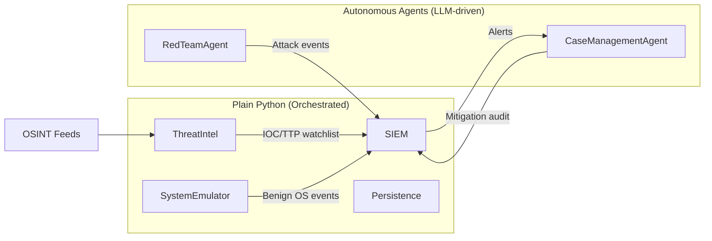
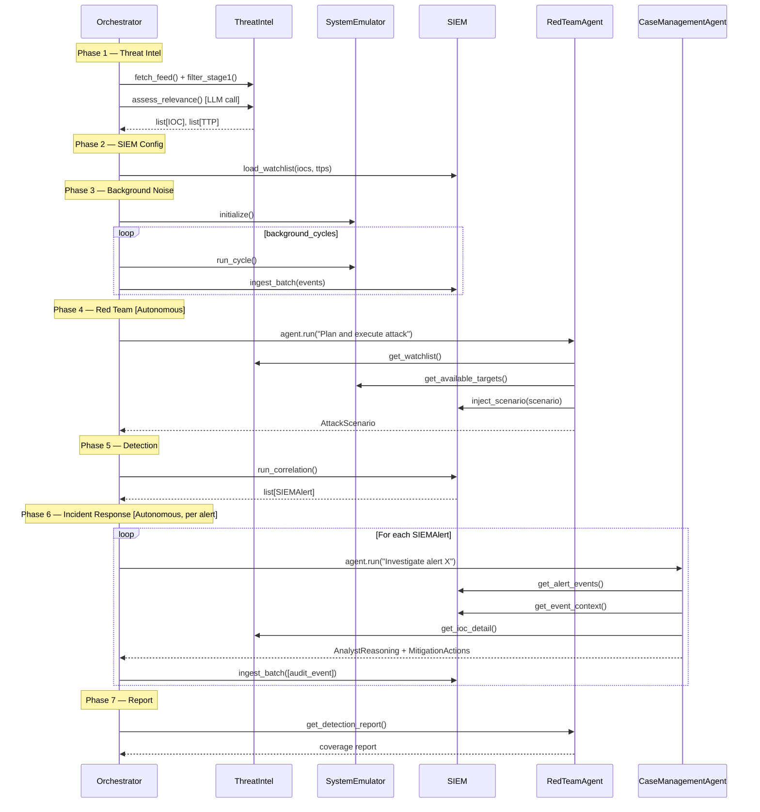

# Autonomous SOC Simulation — Technical Specification

> **Status:** Draft v4 — Revised Architecture
> **Date:** 2026-03-01
> **Author:** SOC Architect

---

## 1. Overview

This document specifies a fully autonomous Security Operations Center (SOC) simulation. The system is composed of **five subsystems**, each implemented at the right level of complexity for its task.

| Subsystem | Real-World Analog | Implementation | Why |
|---|---|---|---|
| **ThreatIntel** | Recorded Future | Plain Python class + 1 LLM call | Filtering is rule-based; only relevance assessment needs LLM judgment |
| **SystemEmulator** | Windows Endpoints | Plain Python class | Pure probabilistic event generation — no LLM needed |
| **SIEM** | Splunk | Plain Python class | Correlation is deterministic dict/pattern matching — no LLM needed |
| **CaseManagementAgent** | TheHive / ServiceNow | PydanticAI Agent | Analyst triage requires multi-step reasoning and judgment |
| **RedTeamAgent** | Adversary Simulation | PydanticAI Agent | Attack planning requires creative, multi-step adversarial reasoning |



**End-to-end loop (driven by `orchestrator.py`):**

1. `ThreatIntel` fetches OSINT feeds, filters with rules, then makes **one LLM call** for contextual relevance assessment → produces IOC/TTP watchlist.
2. `SIEM` loads the watchlist into its correlation engine.
3. `SystemEmulator` generates background OS telemetry for a fleet of Windows endpoints.
4. `SIEM` ingests background events, establishing a benign baseline.
5. `RedTeamAgent` (**autonomous**) reads the watchlist, plans a multi-phase attack scenario, and injects attack events into SIEM.
6. `SIEM` runs correlation searches and fires `SIEMAlert`s.
7. For each alert, `CaseManagementAgent` (**autonomous**) triages, reasons, and produces mitigation actions.
8. Mitigation actions are fed back into `SIEM` as audit events, closing the loop.

---

## 2. Shared Data Models (Pydantic)

All models live in `auto_soc/models/`. They are pure data containers with no logic.

### 2.1 Threat Intel — `models/threat_intel.py`

```python
class IOC(BaseModel):
    id: str                          # UUID4
    type: Literal["ipv4", "ipv6", "domain", "url", "sha256", "md5", "email", "cve"]
    value: str                       # e.g. "203.0.113.42"
    source: str                      # e.g. "abuse.ch"
    severity: Literal["critical", "high", "medium", "low", "info"]
    tags: list[str]                  # e.g. ["cobalt-strike", "c2"]
    first_seen: datetime
    last_seen: datetime
    confidence: float                # 0.0 – 1.0
    context: str                     # LLM-generated note on why this is relevant

class TTP(BaseModel):
    id: str                          # UUID4
    mitre_id: str                    # e.g. "T1059.001"
    name: str
    tactic: str                      # e.g. "Execution"
    description: str
    associated_iocs: list[str]       # IOC.id references
    severity: Literal["critical", "high", "medium", "low"]
    confidence: float

class ThreatIntelReport(BaseModel):
    report_id: str
    generated_at: datetime
    source_feed: str
    raw_item_count: int
    relevant_item_count: int
    iocs: list[IOC]
    ttps: list[TTP]
    summary: str                     # LLM-generated executive summary

class RelevanceConfig(BaseModel):
    max_age_days: int = 30
    min_confidence: float = 0.4
    min_severity: Literal["critical", "high", "medium", "low"] = "medium"
    sector_tags: list[str]           # e.g. ["financial", "banking"]
    excluded_sources: list[str]
```

### 2.2 SIEM — `models/siem.py`

```python
class SIEMEvent(BaseModel):
    event_id: str                    # UUID4
    timestamp: datetime
    source_system: Literal[
        "firewall", "edr", "proxy", "dns",
        "auth", "email_gateway", "red_team"
    ]
    severity: Literal["critical", "high", "medium", "low", "info"]
    raw_log: str
    parsed_fields: dict[str, Any]
    #  Expected keys (any absent → None):
    #  src_ip, dst_ip, action, user, hostname,
    #  process_name, file_hash, domain, url
    matched_ioc_ids: list[str] = []
    matched_ttp_ids: list[str] = []

class CorrelationRule(BaseModel):
    rule_id: str
    name: str
    description: str
    mitre_ids: list[str]
    match_logic: Literal["ioc_match", "ttp_pattern", "threshold", "compound"]
    match_config: dict[str, Any]
    severity: Literal["critical", "high", "medium", "low"]
    enabled: bool

class SIEMAlert(BaseModel):
    alert_id: str
    triggered_at: datetime
    rule: CorrelationRule
    matched_events: list[str]        # SIEMEvent.event_id list
    matched_iocs: list[str]
    matched_ttps: list[str]
    severity: Literal["critical", "high", "medium", "low"]
    status: Literal["new", "acknowledged", "investigating", "closed"]
    summary: str
```

### 2.3 Case Management — `models/case_management.py`

```python
class MitigationAction(BaseModel):
    action_id: str
    action_type: Literal[
        "block_ip", "block_domain", "isolate_host",
        "disable_account", "revoke_token",
        "quarantine_file", "patch_vulnerability", "no_action"
    ]
    target: str
    executed: bool
    executed_at: datetime | None
    notes: str

class AnalystReasoning(BaseModel):
    hypothesis: str
    evidence_for: list[str]
    evidence_against: list[str]
    confidence: float                # 0.0 – 1.0
    verdict: Literal["true_positive", "false_positive", "benign_true_positive", "inconclusive"]
    recommended_actions: list[MitigationAction]

class Incident(BaseModel):
    incident_id: str
    created_at: datetime
    updated_at: datetime
    status: Literal["open", "investigating", "contained", "remediated", "closed"]
    priority: Literal["P1", "P2", "P3", "P4"]
    title: str
    source_alert: SIEMAlert
    affected_assets: list[str]
    analyst_reasoning: AnalystReasoning | None = None
    mitigation_actions: list[MitigationAction] = []
    timeline: list[str]
    summary: str
    closed_at: datetime | None = None
```

### 2.4 Red Team — `models/red_team.py`

```python
class AttackPhase(BaseModel):
    phase_id: str
    order: int
    mitre_id: str
    description: str
    target_endpoint: str             # Hostname from SystemEmulator
    generated_events: list[SIEMEvent]
    delay_seconds: int

class AttackScenario(BaseModel):
    scenario_id: str
    name: str
    target_ttps: list[str]           # TTP.mitre_id values
    target_iocs: list[str]           # IOC.id values to embed
    phases: list[AttackPhase]
    created_at: datetime

class RedTeamConfig(BaseModel):
    difficulty: Literal["easy", "medium", "hard"] = "medium"
    max_scenarios: int = 3
    max_phases_per_scenario: int = 5
    noise_ratio: float = 5.0
```

### 2.5 System Emulator — `models/system_emulator.py`

```python
class WindowsProcess(BaseModel):
    pid: int
    ppid: int
    name: str
    exe_path: str
    command_line: str
    user: str
    started_at: datetime
    sha256: str | None = None

class NetworkConnection(BaseModel):
    src_ip: str
    src_port: int
    dst_ip: str
    dst_port: int
    protocol: Literal["tcp", "udp"]
    state: Literal["established", "closed", "syn_sent", "time_wait"]
    process_name: str
    bytes_sent: int
    bytes_received: int

class WindowsEndpoint(BaseModel):
    hostname: str
    os_version: str
    role: Literal["workstation", "server", "domain_controller"]
    ip_address: str
    mac_address: str
    domain: str
    logged_in_users: list[str]
    processes: list[WindowsProcess]
    active_connections: list[NetworkConnection]

class SystemEmulatorConfig(BaseModel):
    endpoint_count: int = 5
    events_per_cycle: int = 50
    cycle_duration_minutes: int = 15
    roles: list[str] = ["workstation", "workstation", "workstation", "server", "domain_controller"]
    event_weights: dict[str, float] = {
        "process_start": 0.20, "process_stop": 0.10,
        "network_connection": 0.15, "file_operation": 0.12,
        "registry_modification": 0.05, "user_logon": 0.08,
        "user_logoff": 0.03, "service_state_change": 0.04,
        "scheduled_task_run": 0.05, "windows_update": 0.03,
        "dns_query": 0.10, "defender_scan": 0.03, "usb_device": 0.02,
    }
```

---

## 3. Subsystem Designs

### 3.1 ThreatIntel (`threat_intel.py`)

**Type:** Plain Python class with one targeted LLM call.

```python
class ThreatIntel:
    def __init__(self, config: RelevanceConfig, llm_client):
        self.store = ThreatIntelStore()
        self.config = config
        self.llm = llm_client   # pydantic-ai model or raw client

    def fetch_feed(self, feed_url: str) -> list[dict]:
        """Pull raw items from an OSINT feed (simulated). Returns raw dicts."""

    def filter_stage1(self, raw_items: list[dict]) -> list[dict]:
        """Rule-based pre-filter: recency, confidence floor, severity, sector tags, dedup."""

    async def assess_relevance(self, filtered: list[dict]) -> list[IOC | TTP]:
        """Single LLM call. Returns structured IOC/TTP objects with context notes."""
        # Uses pydantic-ai Agent with output_type=BatchRelevanceResult
        # for a one-shot structured extraction — not an autonomous agent.

    def upsert(self, iocs: list[IOC], ttps: list[TTP]) -> ThreatIntelReport:
        """Add/update IOCs and TTPs in store. Returns a ThreatIntelReport."""

    def get_watchlist(self) -> dict[str, list]:
        """Returns {"iocs": [...], "ttps": [...]} of all active items."""
```

> [!NOTE]
> The LLM call in `assess_relevance` is a single structured extraction, not an autonomous loop. The LLM receives a batch of pre-filtered items and returns a `BatchRelevanceResult` with `relevant: bool`, `confidence`, and `context` for each. PydanticAI enforces the output schema.

---

### 3.2 SIEM (`siem.py`)

**Type:** Plain Python class. No LLM anywhere.

```python
class SIEM:
    def __init__(self):
        self.store = SIEMStore()

    def load_watchlist(self, iocs: list[IOC], ttps: list[TTP]) -> None:
        """Populate internal lookup tables for fast correlation."""

    def ingest_event(self, event: SIEMEvent) -> str:
        """Ingest one event: index fields, match IOCs in real-time. Returns event_id."""

    def ingest_batch(self, events: list[SIEMEvent]) -> list[str]:
        """Batch ingest. Returns list of event_ids."""

    def run_correlation(self, rule_id: str | None = None) -> list[SIEMAlert]:
        """Run one or all rules against the event store. Returns new alerts."""

    def search(self, query: dict) -> list[SIEMEvent]:
        """Field-based search: {field: value}."""

    def get_event_context(self, event_id: str, window_seconds: int = 300) -> list[SIEMEvent]:
        """Get surrounding events on same src_ip/hostname within time window."""

    def update_alert_status(self, alert_id: str, status: str) -> SIEMAlert:
        """Transition alert status."""
```

**Correlation logic** is deterministic:
- `ioc_match`: scan `field_index` for any value in the IOC watchlist → O(1) per field
- `ttp_pattern`: sliding window sequence detection on same `hostname`
- `threshold`: count matching events within time window
- `compound`: boolean AND/OR over sub-rules

---

### 3.3 SystemEmulator (`system_emulator.py`)

**Type:** Plain Python class. No LLM anywhere.

```python
class SystemEmulator:
    def __init__(self, config: SystemEmulatorConfig):
        self.store = SystemEmulatorStore()
        self.config = config

    def initialize(self) -> list[WindowsEndpoint]:
        """Bootstrap N endpoints with OS version, users, and base processes."""

    def run_cycle(self) -> list[SIEMEvent]:
        """Generate one cycle of OS events across all endpoints.
        Uses event_weights for probabilistic event selection.
        Updates endpoint state (processes, connections) for consistency.
        Returns SIEMEvents formatted with pseudo-Sysmon raw_log."""

    def get_endpoint(self, hostname: str) -> WindowsEndpoint:
        """Return current state of a specific endpoint."""

    def get_endpoints(self) -> list[WindowsEndpoint]:
        """Return all endpoints (used by RedTeamAgent for target selection)."""
```

---

### 3.4 CaseManagementAgent (`agents/case_management_agent.py`)

**Type:** Autonomous PydanticAI Agent.

The analyst agent is autonomous because triage involves **multi-step reasoning** that can't be pre-scripted: it needs to fetch event context, weigh evidence for and against a hypothesis, decide a verdict, and then derive appropriate actions — all of which depend on what it discovers along the way.

```python
@dataclass
class CaseManagementDeps:
    case_store: CaseStore
    siem: SIEM
    threat_intel: ThreatIntel

case_management_agent = Agent(
    "google-gla:gemini-2.0-flash",
    deps_type=CaseManagementDeps,
    output_type=AnalystReasoning,
    system_prompt=(
        "You are a Tier 2 SOC Analyst. You investigate SIEM alerts by gathering "
        "surrounding event context and IOC details. Produce structured analyst "
        "reasoning with hypothesis, evidence, confidence, verdict, and recommended actions."
    ),
)
```

**Tools available to the agent:**

| Tool | Returns | Purpose |
|---|---|---|
| `get_alert_events(alert_id)` | `list[SIEMEvent]` | Fetch the events that triggered the alert |
| `get_event_context(event_id, window_s)` | `list[SIEMEvent]` | Surrounding events for timeline |
| `get_ioc_detail(ioc_id)` | `IOC` | Full IOC context from ThreatIntel |
| `get_ttp_detail(ttp_id)` | `TTP` | TTP context from ThreatIntel |
| `create_incident(alert)` | `Incident` | Open a case record |
| `update_incident_status(id, status)` | `Incident` | Lifecycle transitions |
| `add_timeline_entry(id, note)` | `Incident` | Log analyst notes |

---

### 3.5 RedTeamAgent (`agents/red_team_agent.py`)

**Type:** Autonomous PydanticAI Agent.

Attack planning is autonomous because the LLM needs to make creative, multi-step decisions about which TTPs to chain, which endpoints to target, how to obfuscate, and how to time events realistically.

```python
@dataclass
class RedTeamDeps:
    threat_intel: ThreatIntel
    siem: SIEM
    system_emulator: SystemEmulator
    config: RedTeamConfig

red_team_agent = Agent(
    "google-gla:gemini-2.0-flash",
    deps_type=RedTeamDeps,
    output_type=AttackScenario,
    system_prompt=(
        "You are a Red Team Operator. Design multi-phase attack scenarios that "
        "use IOCs and TTPs from the threat intel watchlist, targeting specific "
        "emulated endpoints. Follow realistic ATT&CK kill chain ordering."
    ),
)
```

**Tools available to the agent:**

| Tool | Returns | Purpose |
|---|---|---|
| `get_watchlist()` | `dict` | Fetch current IOC/TTP list |
| `get_available_targets()` | `list[dict]` | Fetch endpoint list from SystemEmulator |
| `generate_attack_events(phase)` | `list[SIEMEvent]` | Build realistic SIEM events for one phase |
| `inject_scenario(scenario)` | `dict` | Push all phase events into SIEM with delays |
| `get_detection_report(scenario_id)` | `dict` | Post-run: which events fired alerts? |

---

### 3.6 Orchestrator (`orchestrator.py`)

**Type:** Plain Python async script. No LLM. It sequences subsystem calls.

```python
async def run_simulation(config: SimulationConfig) -> RunMetadata:
    run_id = init_run(config)

    # Phase 1 — Threat Intel
    raw = threat_intel.fetch_feed(config.feed_urls)
    filtered = threat_intel.filter_stage1(raw)
    iocs, ttps = await threat_intel.assess_relevance(filtered)   # ← only LLM call here
    report = threat_intel.upsert(iocs, ttps)
    save_store(run_id, "threat_intel", report)

    # Phase 2 — SIEM Configuration
    siem.load_watchlist(iocs, ttps)

    # Phase 3 — Background Noise
    endpoints = system_emulator.initialize()
    for _ in range(config.background_cycles):
        events = system_emulator.run_cycle()
        siem.ingest_batch(events)
    save_store(run_id, "siem", "events_baseline")

    # Phase 4 — Red Team Attack  (autonomous agent takes over)
    scenario: AttackScenario = await red_team_agent.run(
        "Plan and execute an attack scenario using the current watchlist.",
        deps=RedTeamDeps(threat_intel, siem, system_emulator, config.red_team)
    )
    save_store(run_id, "red_team", scenario)

    # Phase 5 — Detection
    alerts = siem.run_correlation()
    save_store(run_id, "siem", "alerts")

    # Phase 6 — Incident Response (autonomous agent takes over per alert)
    incidents = []
    for alert in alerts:
        reasoning: AnalystReasoning = await case_management_agent.run(
            f"Investigate alert {alert.alert_id} and produce reasoning with actions.",
            deps=CaseManagementDeps(case_store, siem, threat_intel)
        )
        incidents.append(reasoning)
    save_store(run_id, "cases", incidents)

    # Phase 7 — Reporting
    metadata = build_metadata(run_id, alerts, incidents)
    save_metadata(run_id, metadata)
    return metadata
```

> [!IMPORTANT]
> The Orchestrator calls each subsystem **directly** by calling Python methods or awaiting agent runs. There is no LLM sitting above the Orchestrator making decisions. The Orchestrator is the top-level controller.

---

### 3.7 Persistence (`stores/persistence.py`)

Plain Python. Uses Pydantic's `model_dump_json()` / `model_validate_json()`.

**Output directory:**
```
output/{run_id}/
  metadata.json
  threat_intel/  iocs.json  ttps.json  reports.json
  siem/          events.json  alerts.json  rules.json
  cases/         incidents.json
  red_team/      scenarios.json
```

---

## 4. End-to-End Interaction Flow



---

## 5. Project Structure

```
auto-soc/
├── auto_soc/
│   ├── __init__.py
│   ├── config.py                    # Settings (pydantic-settings + .env)
│   ├── orchestrator.py              # run_simulation() — the main entry point
│   ├── models/
│   │   ├── __init__.py
│   │   ├── threat_intel.py
│   │   ├── siem.py
│   │   ├── case_management.py
│   │   ├── red_team.py
│   │   └── system_emulator.py
│   ├── stores/
│   │   ├── __init__.py
│   │   ├── threat_intel_store.py
│   │   ├── siem_store.py
│   │   ├── case_store.py
│   │   ├── system_emulator_store.py
│   │   └── persistence.py
│   └── agents/
│       ├── __init__.py
│       ├── threat_intel.py          # ThreatIntel class (plain Python + 1 LLM call)
│       ├── siem.py                  # SIEM class (plain Python)
│       ├── system_emulator.py       # SystemEmulator class (plain Python)
│       ├── case_management_agent.py # PydanticAI Agent
│       └── red_team_agent.py        # PydanticAI Agent
├── output/                          # JSON persistence (gitignored)
├── tests/
│   ├── test_models.py
│   ├── test_threat_intel.py
│   ├── test_siem.py
│   ├── test_system_emulator.py
│   └── test_orchestrator.py
├── pyproject.toml
├── .env                             # gitignored
├── .env.example
└── README.md
```

---

## 6. Key Design Decisions

| Decision | Choice | Rationale |
|---|---|---|
| **Only 2 autonomous agents** | RedTeam + CaseManagement | Only these require multi-step LLM reasoning; others are deterministic |
| **Plain Python orchestrator** | `run_simulation()` async function | Predictable, debuggable, no LLM fighting the sequence |
| **Single LLM call in ThreatIntel** | `assess_relevance()` with `output_type` | Judgment needed once; PydanticAI enforces the schema |
| **Flat `parsed_fields`** | `dict[str, Any]` on `SIEMEvent` | Flexible, SIEM-agnostic, easy to index |
| **JSON persistence** | `model_dump_json()` per phase | Native Pydantic support, `jq`-queryable, inspectable |
| **Event source tags** | Existing system values (`edr`, `dns`, etc.) | Background OS events blend naturally with real logs |

### Open Questions

1. **OSINT Feed Simulation**: Hardcoded sample IOC data (deterministic) vs LLM-generated fresh IOCs each run (varied)?
2. **Concurrency**: Should the SystemEmulator continue generating background noise *during* the Red Team attack phase, or is sequential (Phase 3 → Phase 4) sufficient for v1?
